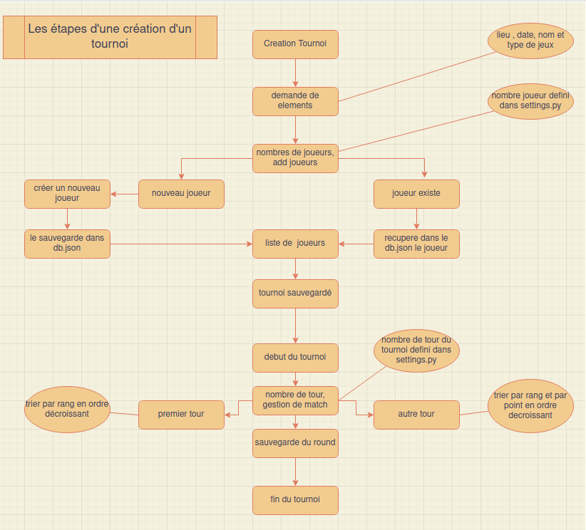

Projet 4: Développez un programme logiciel en Python.

///////////                Votre Gestionnaire de tournoi d'échec           ///////////////

Le programme, en plus de ce fichier README, ce compose de: 

	- 5 scripts python. 
	- 2 packages python.
	- 1 script cfg.
	- 1 fichier deroulement_tournoi.png.
	- 1 fichier requirements.txt ( ressources pip nécessaires à installer dans votre 	  			environement virtuel ). 
	- 1 dossier flake-report dans lequel ce trouve le rapport de recherche d'erreur PEP8.
	  si vous voulez faire un test flake8 , il vous suffit de intaller flake8 :
	  		pip install flake8-html 
	  		ou après avoir fait les étapes 1 et 2.
	  après l' installation appeler le rapport en tapant:
	  		flake8 --format=html --htmldir=flake-report
	  le rapport va être enregistrer dans un dossier portant le nom de flake-report vous y 			trouverez un fichier index.html ouvré ce fichier sur votre navigateur.
	  plus d'information sur le liens ci-joins:
	  			https://flake8.pycqa.org/en/3.1.1/user/index.html	
	
	
Mise en place du programmme:
	
	
	ETAPE 1 : Mise en place de votre environement virtuel. 
	
	- Dans votre terminal, allez dans le repertoire où se situe le dossier qui contient 	tout les fichiers, les dossiers et srcipts du programme. 
	- Créez votre environement virtuel en tapant : 
		sur windows : python -m venv env 
		sur mac ou Unix : python3 -m venv env
	- En cas de besoin, vous trouverez plus d'informations sur docs.python liens ci-joins: 
					https://docs.python.org/fr/3/library/venv.html
	- Activez votre environement en tapant: 
		sur windows :              env\scripts\activate
		sur mac ou Unix :          source env/bin/activate

	- Vous allez voir apparaitre "(env)" en entête de la ligne de commande. 

	ETAPE 2 : Integration des bibliothèques nécessaires pour l'application. 
	
	- Dans votre environement virtuel que vous venez de créer, importez toutes les 			bibliothèques nécessaires en tapant: 
		pip install -r requirements.txt
		
		
	ETAPE 3 : L'application est prête vous pouvez la lancer en tapant: 
		sur windows :              python main.py	
		sur mac ou Unix :          python3 main.py
		

Bienvenue dans votre gestionnaire de tournoi d'échec:
	
	
	1/ Le programme vous permet:
		- d'ajouter de nouveaux joueurs à votre base de données.
		- de modifier les carctéristiques des joueurs.
		- de créer des tournois.
		- de jouer des tournois.
		- de voir le classement par rang.
		- de genérer des rapports.
		
	2/ Navigation dans le programme:
		
		-La navigation s'effectue sur la console.
		Il vous suffit de choisir entre les menus et sous menu la selection  		correspondante à votre besoin.
		Pour sortir du programme sur le menu principal il vous suffit de taper 8.

	3/ La sauvegarde de la base de donnée:
		-La sauvegarde de votre base de donnée se fait en local sur un fichier            			json généré automatiquement lors de la première sauvegarde	 			effectuée.
		Ce fichier se nomme db.json et sera dans les dossiers du programme.	
		
	4/ Création d'un tournoi:
		-Vous pouvez créer un tournoi à l'avance.
		Dans ce cas il vous faudra répondre "non" à la question "voulez vous 			commencer le tournoi?"	
		Vous sortirez alors du programme et reviendriez au menu d'accueil.
			
	5/ Cas particulier:
		-Vous pouvez à tout moment sortir du programme avec l'action :
			Ctrl + c
		Dans le cas de cette fermeture forcée aucune sauvegarde ne			 			sera faite.
		
		-Le nombre de joueurs est par défault à 8 et le nombre de tour à 4.
		Pour changer ces paramètres simplement il vous suffit d'aller sur le script:
			settings.py
		Et de changer ces données.
		
	6/ Diagramme:
		-Vous trouverez au dossier un diagramme expliquant le déroulement de la 
		création d'un tournoi.
			fichier deroulement_tournoi.png
			

	
		 
